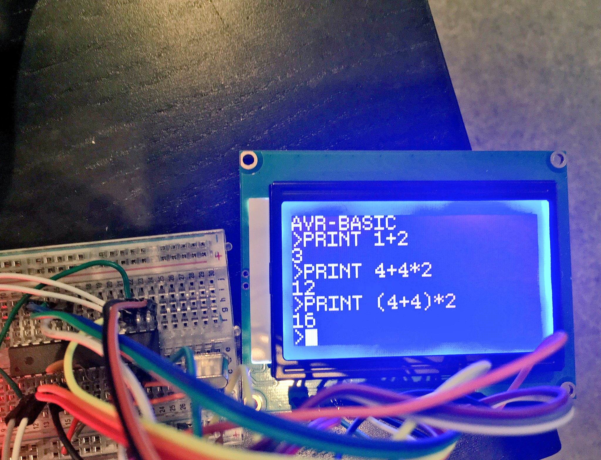

# avrbasic
An interactive BASIC interpreter for the ATmega328p.

Re-live your TRS-80 memories with your ATmega. Maybe.

I'll do a hardware diagram and stuff like that soon.

Parts list:

* ATmega328p
* ST7920, headers, lots of pin–plug header cables
* the keyboard in [`/keyboard`](../tree/keyboard), or anything else that uses UART
* Whatever you use to program and power your AVR

Language description:

* Integers and strings are supported.
  * Integers are any string of numbers from -32768 to 32767.
  * Strings are any set of characters within double-quotes. No escaping is permitted.
* Variables are identified by labels ending in `%` (integers) or `$` (strings).
  * Only the first two letters are significant.
  * `XY%` and `XYZ%` are the same (integer) variable.
  * `XY$` is a (distinct) string variable.
* Expressions are numbers, strings, labels (variable references), in conjunction with any combination of `+`, `-`, `*`, `/`, `=` (equality test).
  * Usual binding order applies.  Override with parentheses.
  * Numbers support all operators.  Strings only support `+` and `=`.
  * Testing equality results in the number `1` (true) or `0` (false) regardless of the operand types.
* The following statements are supported:
  * `LET label = expr` — assign a variable
  * `PRINT expr[, expr …]` — output any expression
  * `INPUT ["MESSAGE",] label` — get user input
  * `IF expr THEN` — start executing code only if expr is a non-zero integer or non-empty string
  * `ELSEIF expr THEN` — during an IF, if a previous block has not executed, start executing code if expr evaluates as above
  * `ELSE` — during an IF/ELSEIF, if no previous block has executed, start executing code
  * `END IF` — end an IF/ELSEIF
  * `[number] stmt` — store program code at the given line number
  * `GOTO number` — transfer program control to given line during `RUN`
  * `RUN` — run stored program
  * `LIST` — list stored program code
  * `CLEAR` – erase stored program (use if pheap runs out)
