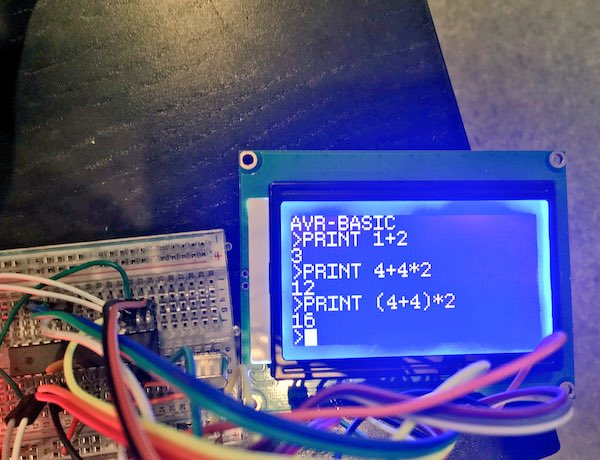

# avrbasic
A BASIC implementation for the ATmega328p.

I'll do a hardware diagram and stuff like that soon.

Parts list:

* ATmega328p
* ST7920, headers, lots of pin–plug header cables
* the keyboard in [`/keyboard`](/keyboard), or anything else that uses UART
* Whatever you use to program and power your AVR
